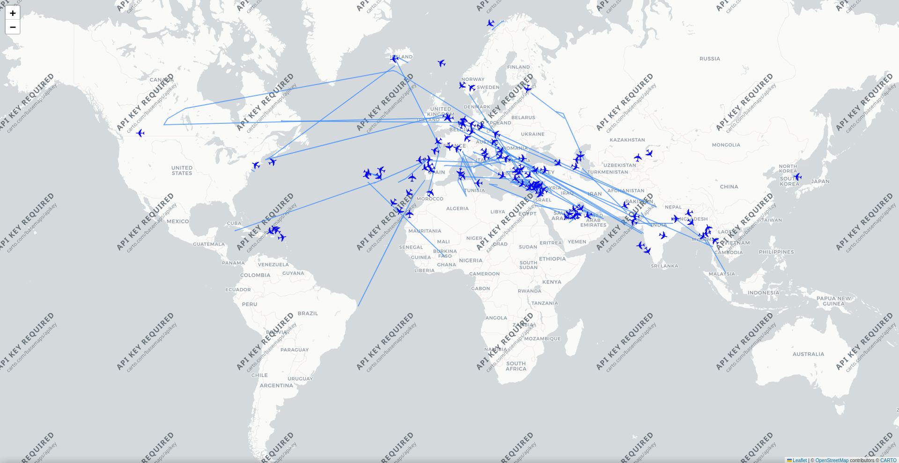
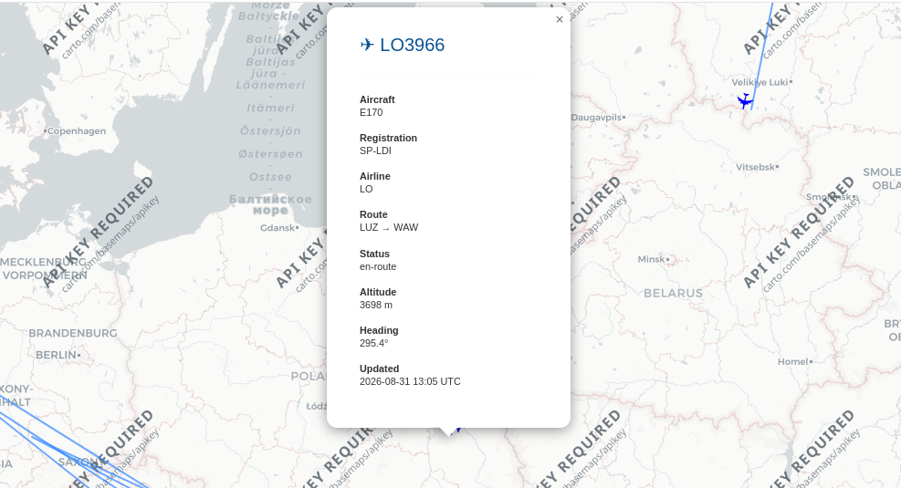
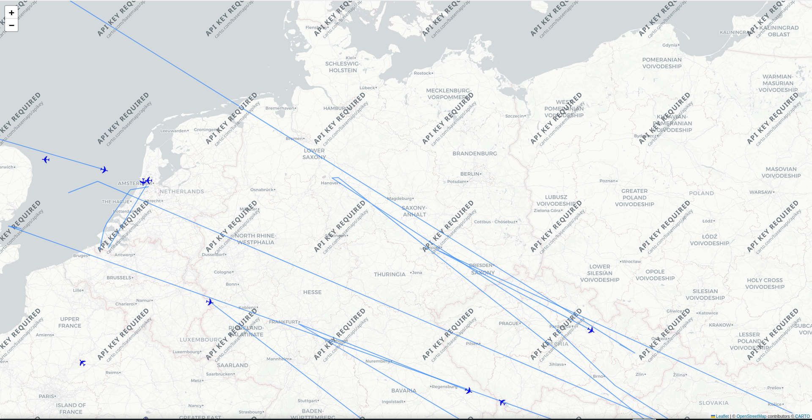

# Flight Visualiser

This is a Python-based flight visualiser that displays live aircraft data on an interactive map. The project uses the AirLabs API to retrieve aircraft information and Folium to generate the map, displaying aircraft positions, flight paths, and aircraft trails.

## Features

- Live aircraft data retrieved from the AirLabs API
- Interactive Folium map
- Aircraft markers showing flight information
- Aircraft position updates on each refresh
- Flight paths showing previous aircraft positions
- Animated flight paths using AntPath
- Automatic map refreshes at a configurable interval
- Aircraft markers that indicate heading/direction

## Technologies used

- **Python** - Main programming language used for developing the application.
- **Folium** - Python library used to generate the interactive map and display the live aircraft data.
- **AirLabs API** - Provides the live flight data.
- **Requests** - Used to send HTTP requests to the Airlabs API.
- **JSON** - Used to store aircraft and flight data, as well as recorded aircraft positions for trails.
- **HTML** - Used as the output format for the map.
- **Git & GitHub** - Used for version control and project management.

## How it works

The application retrieves live aircraft data from the AirLabs API using HTTP requests. The returned data is processed in Python and used to generate an interactive map with Folium.

For each aircraft, the application:

- Retrieves its current position and available flight information from the AirLabs API.
- Processes the returned data and extracts relevant information such as flight number, aircraft type, registration, altitude and heading.
- Adds the aircraft to the Folium map using a marker that indicates its current heading.
- Displays additional flight information through an interactive popup.
- Records previous aircraft positions to create flight trails.
- Uses AntPath to animate the flight paths between recorded positions.
- Generates the map as an HTML file.
- Automatically refreshes the map at a configurable interval to retrieve updated aircraft positions.

## Screenshots

### Main map



### Flight information



### Trails



## Installation

### 1. Clone the repository

Clone the repository using Git:

```bash
git clone https://github.com/adiSA-bit/Python-Flight-Visualiser-Project.git
```

Navigate into the repository directory:

```bash
cd Python-Flight-Visualiser-Project/
```

### 2. Create a virtual environment

Create a Python virtual environment:

```bash
python -m venv venv
```

Activate the virtual environment.

**Windows**:

```bash
venv\Scripts\activate
```

**macOS/Linux**:

```bash
source venv/bin/activate
```

### 3. Install dependencies

Install the required Python packages using the provided requirements.txt file:

```bash
pip install -r requirements.txt
```
 
Once the dependencies have been installed, proceed to the Configuration section.

## Configuration

The application includes a small number of configurable settings that can be adjusted in `app.py`.

### Update Interval

The `UPDATE_INTERVAL` variable controls how frequently the aircraft data and map are refreshed.

```python
UPDATE_INTERVAL = 60
```

## Usage

- Run `app.py`.
- The application retrieves aircraft data from AirLabs.
- The Folium map is generated and updated.
- Open the generated map in a browser.
- The map automatically refreshes according to the `UPDATE_INTERVAL` value.
- Click aircraft markers to view information such as flight number, departure/arrival airport, heading and aircraft type.
- Aircraft trails show the previously recorded positions of every flight.

## Project structure

```
Python-Flight-Visualiser-Project/
├── screenshots/
├── README.md
├── aircrafts.json
├── airports.json
├── app.py
├── flights.json
├── my_flight_visualizer.html
├── requirements.txt
└── test.py
```

## Future improvements

- Improved flight trail management — prevent old/stale trail data from persisting between sessions.
- Additional map features — Filtering aircraft by airline, aircraft type, altitude, or flight status.
- Better map performance — optimise the map when displaying large numbers of aircraft and trails.
- More configurable settings — allow users to change the refresh interval and number of aircraft displayed.

## Limitations

- API limitations — aircraft data depends on the AirLabs API and its available request limits.
- Data availability — the information displayed depends on what data AirLabs provides for each aircraft.
- Map performance — displaying a large number of aircraft and historical trails may affect performance.
- Trail persistence — recorded trails can persist between sessions, which can result in outdated trail data being displayed.
- Refresh interval — aircraft positions are updated at intervals rather than continuously, so the displayed position may not always represent the aircraft's exact current location.
- API key - The CARTO basemap currently requires an API key due to changes to CARTO's tile access policy, which may result in an API key requirement being displayed on the map. This does not affect the flight data or visualisation functionality.
